# vue-basic-components

[](https://npmjs.com/package/vue-basic-components)

[](https://npmjs.com/package/vue-basic-components)

vue 项目基础组件库（编辑表格、编辑表单、编辑上传表格、拖拽进度块）

文档中若有样例可参考，无样例可参考代码使用（若代码垃圾请海涵）

### **安装**：

```
	npm install vue-basic-components
```


#### 在 main.js 引入：

```
	import VueBasicComponents from 'vue-basic-components/package/index'
	Vue.use(VueBasicComponents)
```

### **介绍**：

#### 1，TableEdit 组件支持分页

###### 属性(refs调用)

componentDisabled：表格是否禁用

tableLoading：表格的加载展示

data：表格数据

selection：选中的行下标

###### props
title: 表格title

size：表格大小

required 表格titlt部位必填展示

fields：表格单行各个字段

columns：表格列对象、属性有label，type（支持text、input、select、date），pickerType（支持type为date），required，disabled，field，width，format（支持date），valueFormat（支持date），options（支持select）等

type：表格类型（支持selection、index）

addable：表格是否支持可添加

deletable：表格是否自带删除操作栏

sortable：表格是否支持行拖拽排序（属性componentDisabled为true时若禁用拖拽排序功能需要给组件实例加'not-sort'样式类）

actionColumnWidth：操作列宽

isPagination：是否展示分页（前端分页）

pageSize：当前页展示的行数（支持isPagination为true时）

isAddedTrigger：是否自定义添加表格行，若为true需要在父组件内定义@handleAdd事件接收

###### 方法
@handleSort({ newIndex, oldIndex }) { ... }

@handleAdd() { ... }

@handleDelete(index, row) { ... }

###### 示例
```
<table-edit
	:class="editing ? '' : 'not-sort'"
	style="margin: 10px 0"
	ref="companyTableEdit"
	title="董事/监事/高管"
	:required="true"
	type="index"
	@handleDelete="handleDelete"
	@handleSort="handleSort"
	:deletable="true"
	:sortable="true"
	:actionColumnWidth="200"
	:fields="fields"
	:columns="columns"
/>
```

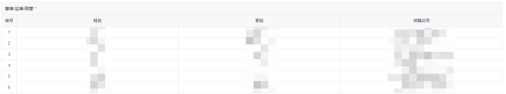

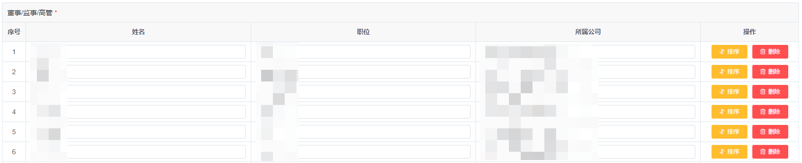

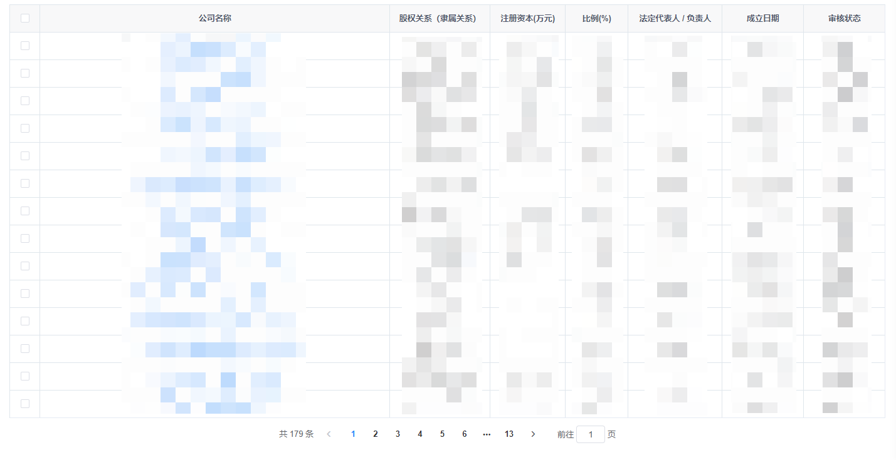


#### 2，TableForm 组件

###### 属性(refs调用)

componentDisabled：表单是否禁用

###### props

data：表单数组对象

注：每个对象obj含有如下属性

obj.label--表单域显示label

obj.id--表单域字段

obj.value--表单域值：

obj.type--表单域类型，支持text、input、select、date

obj.pickerType--支持表单域类型为date

obj.disabled--表单域是否禁用

obj.require--表单域是否必填

obj.span--表单域宽，同el-col的span属

obj.actions--表单域操作项数组对象，每个对象属性含有

actions.type----操作项按钮类型同elementui的success、warning、danger、default、text等）

actions.text----操作项按钮文字

actions.visible----操作项是否展示

actions.size----操作项按钮尺寸

actions.click----操作项点击事件

actions.options----支持表单域类型为select

actions.format----支持表单域类型为date

actions.valueFormat----支持表单域类型为date

###### 示例

```
<table-form ref="originTableForm" :data="originInfo" />

```

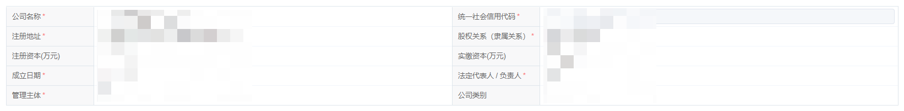

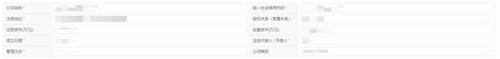

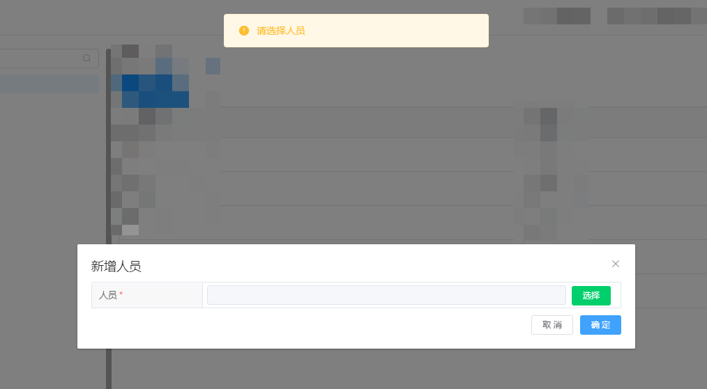


#### 3，TableUpload 组件

###### 属性(refs调用)

componentDisabled：表格是否禁用

tableLoading：表格的加载展示

selection：选中的行下标

###### props

fields：表格单行各个字段

columns：表格列对象、属性有label，field（文件名字段必须为fileName），click（row）{}

type：表格类型（支持selection、index）

deletable：表格是否自带删除操作栏

actionColumnWidth：操作列宽

fileList：文件列表

###### 方法

@handleDelete(file) { ... }

@handleDownload(file) { ... }

###### 示例

```
<table-upload
	:deletable="true"
	type="index"
	@handleDelete="handleDelete"
	@handleDownload="handleDownload"
	:actionColumnWidth="200"
	:fileList="fileList"
	:fields="fields"
	:columns="columns"
/>

```

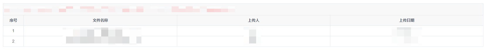

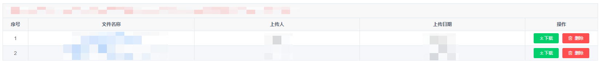


#### 4，DragProgress 组件

###### props

progressVal：当前显示进度值

isDrag：是否可自定义拖拽

bgColor：进度条颜色

###### 方法

@stop(percent) { ... }

###### 示例

```
<drag-progress
	@stop="progress"
	:value="progressVal"
	:isDrag="true"
	bgColor="#409EFF"
/>

```

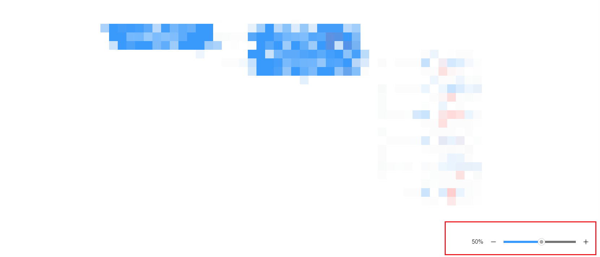


#### 5，SelectPerson 组件

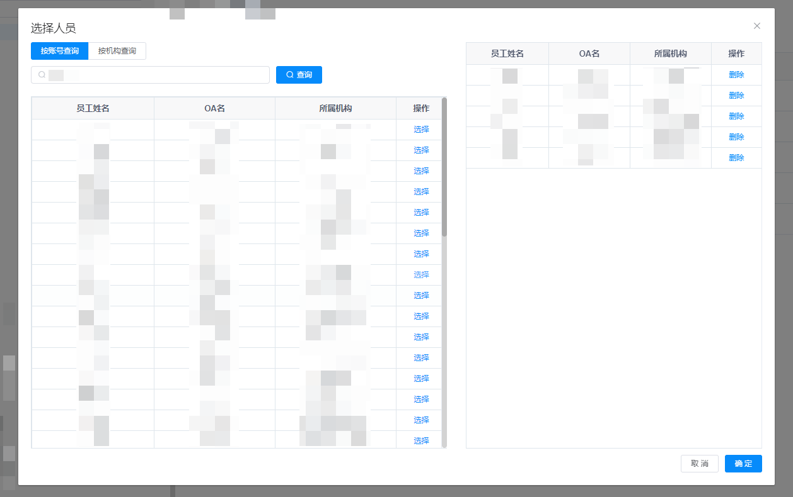

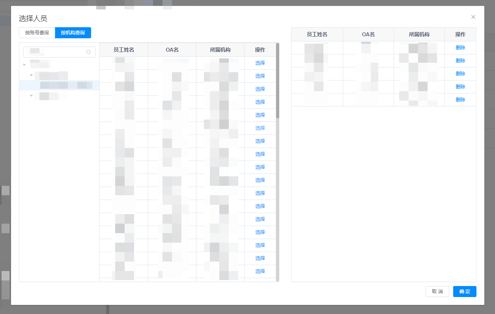


#### 6，TableTransmitter 组件

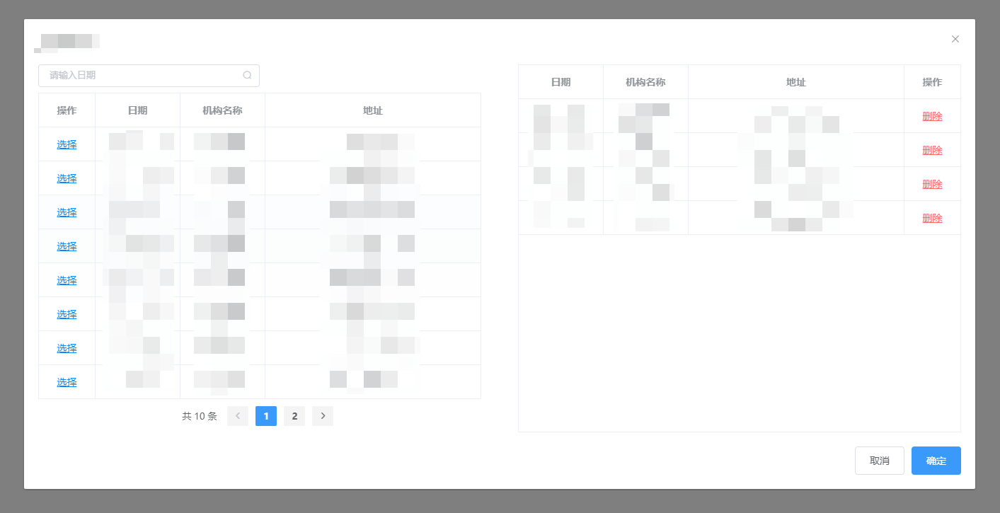
